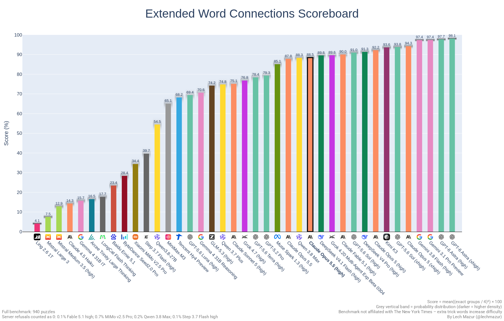
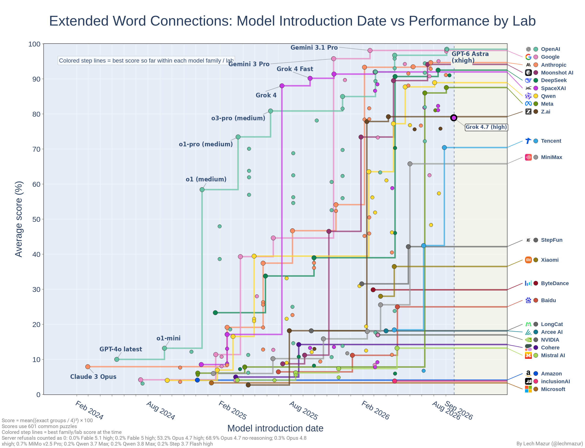
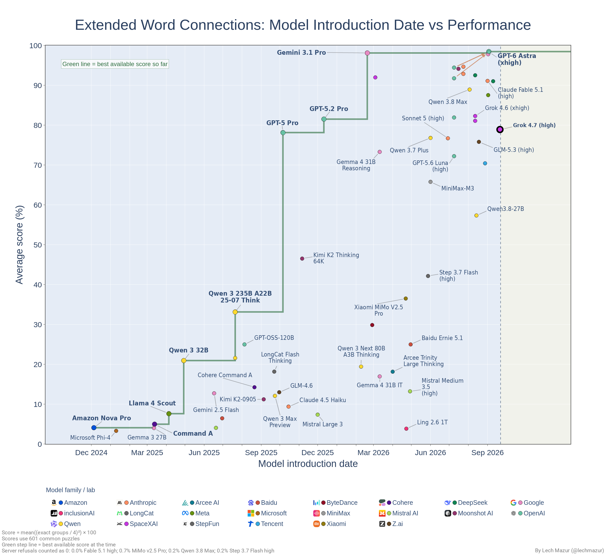
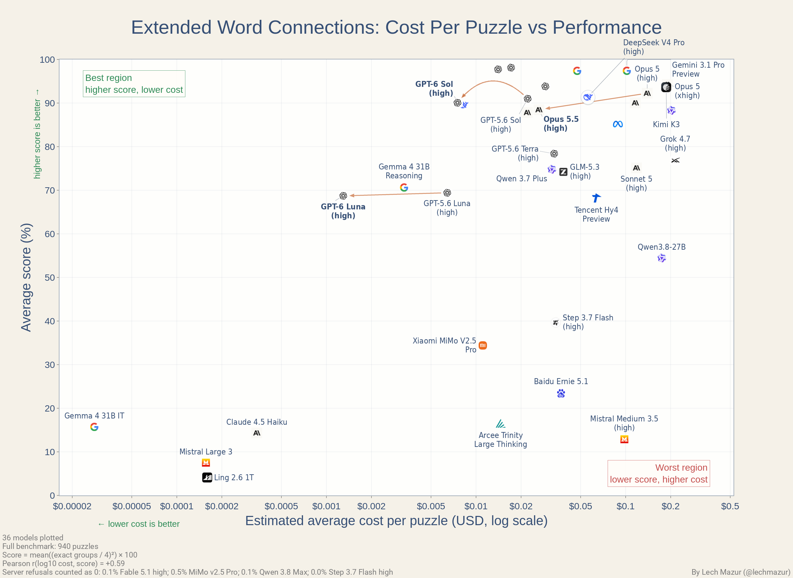
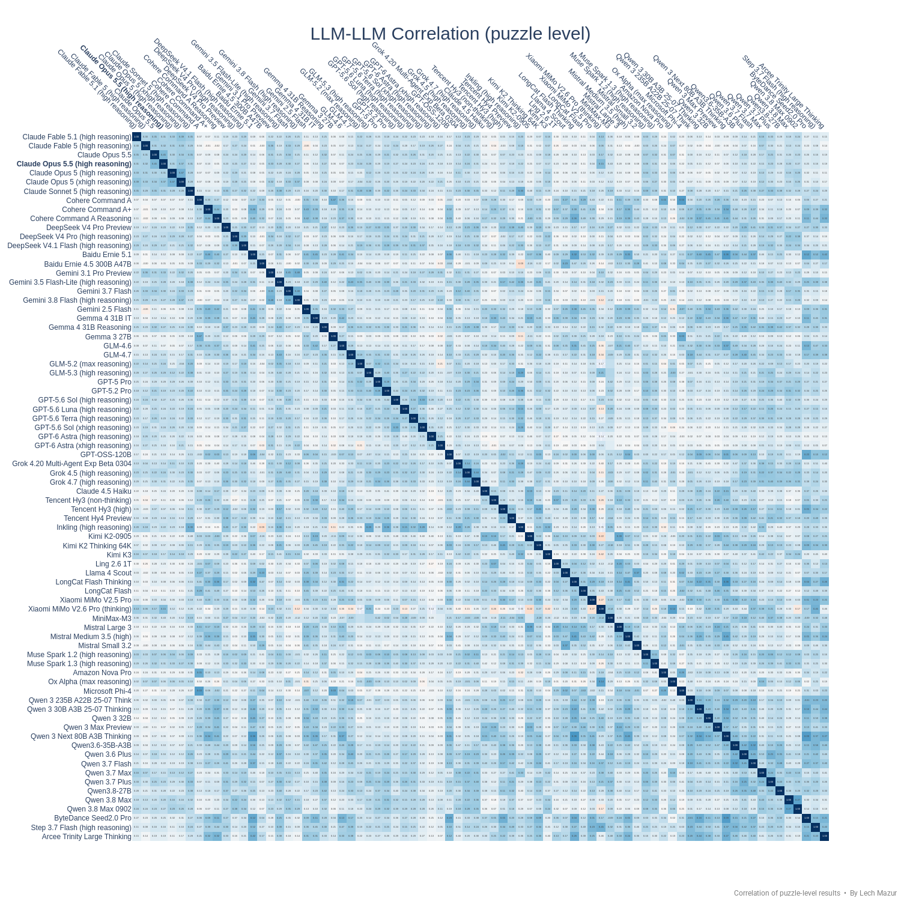
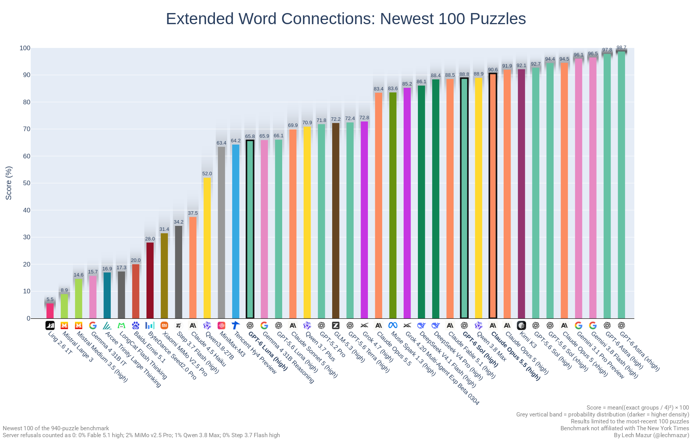

# Extended Version

This benchmark evaluates large language models (LLMs) using 940 NYT Connections puzzles, with additional words included to increase difficulty.

To increase difficulty compared to standard NYT Connections puzzles, Extended Connections adds up to four extra trick words to each puzzle. We check that none of the added words fit into any category used in the corresponding puzzle.

Headline results use quadratic-v1 scoring: a puzzle with `g` exact groups
contributes `(g / 4)²`, so 0, 1, 2, 3, and 4 groups earn 0%, 6.25%, 25%,
56.25%, and 100%, respectively. The leaderboard score is the mean of those
per-puzzle values.

### Chart: Extended Version

Scoreboard and model-comparison charts apply the current chart-suppression
policy. The leaderboard tables retain every full-coverage result, including
models omitted from charts, so historical results remain available for
comparison. Claude Fable 5.1 high, Gemini 3.8 Flash high, Tencent Hy4 Preview,
and Muse Spark 1.3 high are the highlighted models. Scatter progression arrows
connect the directly comparable predecessor runs: Claude Fable 5 high to Fable
5.1 high, Tencent Hy3 high to Hy4 Preview, and Muse Spark 1.2 high to Muse Spark
1.3 high. Gemini 3.7 Flash is suppressed and has no arrow to Gemini 3.8 Flash
high because the two runs used different reasoning levels.

Current highlighted-model results:

- Gemini 3.8 Flash (high) ties Gemini 3.1 Pro for first place at 97.4.
- Fable 5.1 (high) does not improve on Fable 5 (high): 92.7 → 90.0,
  although it costs about 18% less per puzzle. Its one explicit provider
  refusal, on the September 28, 2025 puzzle, counts as a 0/4 attempt.
- Muse Spark 1.3 (high) improves on Muse Spark 1.2 (high): 79.2 → 85.1,
  but uses 1.4× as many reasoning tokens.
- Tencent Hy4 Preview (high) improves substantially on Tencent Hy3 (high):
  41.2 → 68.2, but costs 5.8× as much per puzzle.

### Leaderboard: Extended Version

The main board includes only models that completed all 940 puzzles.

|Rank|Model|Score %|#Puzzles|
|---:|-----|----------------:|-------:|
|1|Gemini 3.1 Pro Preview|97.4|940|
|2|Gemini 3.8 Flash (high reasoning)|97.4|940|
|3|GPT-5.5 (xhigh reasoning)|96.2|940|
|4|GPT-5.5 (high reasoning)|95.2|940|
|5|Gemini 3 Pro Preview|94.4|940|
|6|Claude Opus 5 (xhigh reasoning)|94.3|940|
|7|Gemini 3.7 Flash|94.0|940|
|8|GPT-5.6 Sol (xhigh reasoning)|93.8|940|
|9|Kimi K3|93.6|940|
|10|Claude Fable 5 (high reasoning)|92.7|940|
|11|Gemini 3.5 Flash|92.6|940|
|12|GPT-5.5 (medium reasoning)|92.4|940|
|13|Claude Opus 5 (high reasoning)|92.2|940|
|14|Claude Opus 4.6 (high reasoning)|92.1|940|
|15|DeepSeek V4 Pro (high reasoning)|91.3|940|
|16|GPT-5.4 (xhigh reasoning)|91.3|940|
|17|Claude Opus 4.8 (xhigh reasoning)|91.1|940|
|18|GPT-5.6 Sol (high reasoning)|91.0|940|
|19|GPT-5.4 (high reasoning)|90.6|940|
|20|Claude Fable 5.1 (high reasoning)|90.0|940|
|21|Grok 4.20 Multi-Agent Exp Beta 0304|89.6|940|
|22|DeepSeek V4 Flash|89.6|940|
|23|Gemini 3.6 Flash|89.0|940|
|24|Claude Opus 4.8 (high reasoning)|88.3|940|
|25|Qwen 3.8 Max|88.3|940|
|26|GPT-5.4 (medium reasoning)|87.8|940|
|27|Grok 4.1 Fast Reasoning|87.4|940|
|28|Kimi K2.6|87.2|940|
|29|Grok 4.20 0309 (Reasoning)|85.4|940|
|30|Qwen 3.7 Max|85.1|940|
|31|Muse Spark 1.3 (high reasoning)|85.1|940|
|32|Muse Spark 1.1 (high reasoning)|84.9|940|
|33|Grok 4.20 Reasoning Exp Beta 0304|83.7|940|
|34|GPT-5.2 (xhigh reasoning)|83.6|940|
|35|Gemini 3 Flash Preview|83.1|940|
|36|Claude Sonnet 4.6 (high reasoning)|80.9|940|
|37|Grok 4.6 (xhigh reasoning)|80.0|940|
|38|Grok 4.5 (high reasoning)|79.9|940|
|39|GPT-5.2 Pro|79.3|940|
|40|Muse Spark 1.2 (high reasoning)|79.2|940|
|41|Grok 4.6 (high reasoning)|79.0|940|
|42|GPT-5.6 Terra (high reasoning)|78.4|940|
|43|GLM-5.1|77.7|940|
|44|Claude Sonnet 4.6 Thinking 32K|76.4|940|
|45|Claude Opus 4.6 Thinking 16K|76.4|940|
|46|Claude Sonnet 5 (high reasoning)|75.1|940|
|47|GLM-5|74.8|940|
|48|Qwen 3.7 Plus|74.8|940|
|49|GLM-5.2 (high reasoning)|74.3|940|
|50|GLM-5.3 (high reasoning)|74.2|940|
|51|Qwen 3.6 Max Preview|74.1|940|
|52|Gemma 4 31B Reasoning|70.6|940|
|53|Kimi K2.5 Thinking|69.9|940|
|54|GPT-5.6 Luna (high reasoning)|69.4|940|
|55|Tencent Hy4 Preview|68.2|940|
|56|GPT-5.2 (high reasoning)|68.1|940|
|57|DeepSeek V4 Pro Preview|67.3|940|
|58|MiniMax-M3|65.1|940|
|59|GPT-5.4 Mini (xhigh reasoning)|61.8|940|
|60|GPT-5.2 (medium reasoning)|60.6|940|
|61|Gemini 3.5 Flash-Lite (high reasoning)|60.4|940|
|62|Qwen 3.6 Plus|60.3|940|
|63|Qwen3.5-397B-A17B|58.9|940|
|64|Grok 4.3|55.2|940|
|65|Qwen3.8-27B|54.5|940|
|66|GPT-5.2 (low reasoning)|54.2|940|
|67|Claude Opus 4.5 Thinking 16K|52.5|940|
|68|Qwen3.5-122B-A10B|51.7|940|
|69|Claude Opus 4.5 (no reasoning)|49.4|940|
|70|Claude Sonnet 4.6 Thinking 16K|48.0|940|
|71|Qwen3.5-27B|47.9|940|
|72|Claude Sonnet 4.6 (no reasoning)|44.8|940|
|73|Qwen 3.7 Flash|43.8|940|
|74|Claude Opus 4.6 (no reasoning)|43.2|940|
|75|Qwen3.6-35B-A3B|41.6|940|
|76|Tencent Hy3 (high)|41.2|940|
|77|Step 3.7 Flash (high reasoning)|39.7|940|
|78|Claude Opus 4.7 (high reasoning)|39.0|940|
|79|Claude Sonnet 4.5 Thinking 16K|37.3|940|
|80|DeepSeek V3.2|36.7|940|
|81|Claude Sonnet 4.5 (no reasoning)|35.8|940|
|82|Xiaomi MiMo V2.5 Pro|34.4|940|
|83|Qwen3 Max (2026-01-23)|30.1|940|
|84|Step 3.5 Flash|28.4|940|
|85|ByteDance Seed2.0 Pro|28.4|940|
|86|Xiaomi MiMo V2 Pro|25.8|940|
|87|MiniMax-M2.7|24.7|940|
|88|Baidu Ernie 5.1|23.4|940|
|89|GPT-5.5 (no reasoning)|22.0|940|
|90|GPT-5.4 (no reasoning)|17.8|940|
|91|LongCat Flash Thinking|17.7|940|
|92|Tencent Hy3 Preview|17.2|940|
|93|MiniMax-M2.5|16.8|940|
|94|Arcee Trinity Large Thinking|16.5|940|
|95|Gemma 4 31B IT|15.7|940|
|96|Nemotron 3 Super|15.4|940|
|97|MiniMax-M2|14.8|940|
|98|GPT-5.2 (no reasoning)|14.5|940|
|99|Claude 4.5 Haiku|14.3|940|
|100|Mistral Medium 3.5 (high)|12.9|940|
|101|Grok 4.1 Fast Non-Reasoning|12.3|940|
|102|Qwen 3 Max Thinking|11.8|940|
|103|MiniMax-M2.1|11.2|940|
|104|Claude Opus 4.7 (no reasoning)|10.8|940|
|105|Baidu Ernie 5.0|10.3|940|
|106|Grok 4.20 0309 (Non-Reasoning)|8.6|940|
|107|DeepSeek V3.2 (no reasoning)|8.2|940|
|108|Gemini 3.1 Flash-Lite Preview|8.2|940|
|109|Llama 4 Maverick|8.0|940|
|110|Grok 4.20 Non-Reasoning Exp Beta 0304|7.6|940|
|111|Mistral Large 3|7.5|940|
|112|Tencent Hy3 (non-thinking)|6.9|940|
|113|Mistral Medium 3.1|6.5|940|
|114|Ling 2.6 1T|4.1|940|

---
## Model comparison scatter charts

### Model family progress

This chart shows score progress over time within each model family on a shared
601-puzzle comparison set.

### Introduction date vs. score

This chart compares benchmark score against model introduction date on the
same shared 601-puzzle comparison set.

### Cost vs. performance

This chart compares estimated average cost per puzzle with benchmark
score for current full-coverage models.

---
### Correlation of puzzle-level results: heatmap

---
## Newest 100 puzzles.

To counteract the possibility of an LLM's training data including the solutions, we have also tested only the 100 latest puzzles. Note that lower scores do not necessarily indicate that NYT Connections solutions are in the training data, as the difficulty of the first puzzles was lower.

---
### Chart: Newest 100 puzzles, extended version

This scoreboard chart applies the same chart-suppression policy as the full
benchmark chart.

### Leaderboard: Newest 100 puzzles, extended version

This view applies the same scoring rule to the newest 100 puzzles for every full-coverage model.

|Rank|Model|Score %|#Puzzles|
|---:|-----|----------------:|-------:|
|1|Gemini 3.8 Flash (high reasoning)|96.5|100|
|2|Gemini 3.1 Pro Preview|96.1|100|
|3|GPT-5.5 (xhigh reasoning)|96.1|100|
|4|GPT-5.5 (high reasoning)|95.2|100|
|5|Claude Opus 5 (xhigh reasoning)|94.5|100|
|6|GPT-5.6 Sol (xhigh reasoning)|94.4|100|
|7|Claude Fable 5 (high reasoning)|93.6|100|
|8|GPT-5.4 (xhigh reasoning)|93.4|100|
|9|GPT-5.6 Sol (high reasoning)|92.7|100|
|10|Gemini 3 Pro Preview|92.3|100|
|11|Gemini 3.7 Flash|92.2|100|
|12|Claude Opus 4.8 (high reasoning)|92.1|100|
|13|Kimi K3|92.1|100|
|14|Claude Opus 5 (high reasoning)|91.9|100|
|15|Gemini 3.5 Flash|90.8|100|
|16|Claude Opus 4.8 (xhigh reasoning)|90.6|100|
|17|Qwen 3.8 Max|88.9|100|
|18|Claude Fable 5.1 (high reasoning)|88.5|100|
|19|Gemini 3.6 Flash|88.5|100|
|20|DeepSeek V4 Pro (high reasoning)|88.4|100|
|21|GPT-5.4 (high reasoning)|88.4|100|
|22|Claude Opus 4.6 (high reasoning)|88.1|100|
|23|GPT-5.5 (medium reasoning)|87.3|100|
|24|DeepSeek V4 Flash|87.2|100|
|25|Grok 4.20 Multi-Agent Exp Beta 0304|85.2|100|
|26|Muse Spark 1.1 (high reasoning)|84.8|100|
|27|GPT-5.4 (medium reasoning)|84.4|100|
|28|Muse Spark 1.3 (high reasoning)|83.6|100|
|29|Kimi K2.6|80.2|100|
|30|Qwen 3.7 Max|78.9|100|
|31|GPT-5.2 (xhigh reasoning)|78.6|100|
|32|Claude Opus 4.6 Thinking 16K|78.4|100|
|33|GLM-5.1|77.6|100|
|34|Grok 4.20 0309 (Reasoning)|77.4|100|
|35|Muse Spark 1.2 (high reasoning)|77.2|100|
|36|Grok 4.5 (high reasoning)|77.2|100|
|37|Grok 4.20 Reasoning Exp Beta 0304|77.1|100|
|38|Grok 4.6 (xhigh reasoning)|77.1|100|
|39|Grok 4.1 Fast Reasoning|75.2|100|
|40|Grok 4.6 (high reasoning)|74.6|100|
|41|Claude Sonnet 4.6 (high reasoning)|74.1|100|
|42|GLM-5.2 (high reasoning)|72.8|100|
|43|GPT-5.6 Terra (high reasoning)|72.4|100|
|44|GLM-5.3 (high reasoning)|72.2|100|
|45|GPT-5.2 Pro|71.8|100|
|46|Qwen 3.7 Plus|70.9|100|
|47|Claude Sonnet 5 (high reasoning)|69.9|100|
|48|Claude Sonnet 4.6 Thinking 32K|69.4|100|
|49|Qwen 3.6 Max Preview|69.4|100|
|50|GLM-5|67.5|100|
|51|GPT-5.2 (high reasoning)|66.2|100|
|52|GPT-5.6 Luna (high reasoning)|66.1|100|
|53|Gemma 4 31B Reasoning|65.9|100|
|54|Tencent Hy4 Preview|64.2|100|
|55|Kimi K2.5 Thinking|63.7|100|
|56|MiniMax-M3|63.4|100|
|57|GPT-5.4 Mini (xhigh reasoning)|62.5|100|
|58|Gemini 3 Flash Preview|61.8|100|
|59|Gemini 3.5 Flash-Lite (high reasoning)|60.7|100|
|60|DeepSeek V4 Pro Preview|59.9|100|
|61|Qwen 3.6 Plus|57.1|100|
|62|GPT-5.2 (medium reasoning)|55.8|100|
|63|Qwen3.8-27B|52.0|100|
|64|Claude Opus 4.5 Thinking 16K|51.6|100|
|65|Qwen3.5-397B-A17B|47.1|100|
|66|GPT-5.2 (low reasoning)|46.4|100|
|67|Grok 4.3|45.6|100|
|68|Qwen3.5-122B-A10B|45.4|100|
|69|Claude Sonnet 4.6 Thinking 16K|45.3|100|
|70|Qwen3.5-27B|44.6|100|
|71|Claude Sonnet 4.5 (no reasoning)|43.6|100|
|72|Claude Sonnet 4.5 Thinking 16K|43.0|100|
|73|Claude Opus 4.5 (no reasoning)|42.0|100|
|74|Tencent Hy3 (high)|40.6|100|
|75|Claude Sonnet 4.6 (no reasoning)|40.4|100|
|76|Claude Opus 4.7 (high reasoning)|39.3|100|
|77|Claude 4.5 Haiku|37.5|100|
|78|Claude Opus 4.6 (no reasoning)|37.2|100|
|79|Qwen3.6-35B-A3B|35.5|100|
|80|Qwen 3.7 Flash|35.4|100|
|81|Step 3.7 Flash (high reasoning)|34.2|100|
|82|Qwen3 Max (2026-01-23)|31.6|100|
|83|Xiaomi MiMo V2.5 Pro|31.4|100|
|84|DeepSeek V3.2|29.7|100|
|85|MiniMax-M2.7|28.6|100|
|86|ByteDance Seed2.0 Pro|28.0|100|
|87|Step 3.5 Flash|22.8|100|
|88|Xiaomi MiMo V2 Pro|22.0|100|
|89|Baidu Ernie 5.1|20.0|100|
|90|GPT-5.4 (no reasoning)|19.8|100|
|91|GPT-5.5 (no reasoning)|19.1|100|
|92|Tencent Hy3 Preview|18.9|100|
|93|LongCat Flash Thinking|17.3|100|
|94|Arcee Trinity Large Thinking|16.9|100|
|95|MiniMax-M2.5|16.2|100|
|96|GPT-5.2 (no reasoning)|15.8|100|
|97|Gemma 4 31B IT|15.7|100|
|98|Mistral Medium 3.5 (high)|14.6|100|
|99|MiniMax-M2.1|12.8|100|
|100|Nemotron 3 Super|12.4|100|
|101|Claude Opus 4.7 (no reasoning)|11.9|100|
|102|MiniMax-M2|11.9|100|
|103|Qwen 3 Max Thinking|11.6|100|
|104|Baidu Ernie 5.0|10.7|100|
|105|Grok 4.20 0309 (Non-Reasoning)|9.4|100|
|106|Mistral Large 3|8.9|100|
|107|Gemini 3.1 Flash-Lite Preview|8.9|100|
|108|Grok 4.1 Fast Non-Reasoning|8.8|100|
|109|Tencent Hy3 (non-thinking)|8.2|100|
|110|Llama 4 Maverick|8.1|100|
|111|Grok 4.20 Non-Reasoning Exp Beta 0304|7.7|100|
|112|Mistral Medium 3.1|7.1|100|
|113|DeepSeek V3.2 (no reasoning)|6.8|100|
|114|Ling 2.6 1T|5.5|100|

---
# Humans vs. LLMs

To explore how top language models (LLMs) compare to humans in the New York Times Connections puzzle, we used official NYT performance data from December 2024 to February 2025, as analyzed by u/Bryschien1996, alongside a simulated gameplay setup that mirrors the human experience. This setup involves a multi-step process where solvers iteratively propose groups, receive feedback ("correct," "one away," "incorrect"), and are allowed up to four mistakes before failing. According to NYT data, the average human player solved approximately 71% of puzzles over the three-month period from December 2024 to February 2025, with solve rates ranging from 39% on the toughest days (e.g., February 2, 2025) to 98% on the easiest (e.g., February 26, 2025). It's worth noting that NYT Connections players are self-selected and likely perform better than the general population. We collected data from nine LLMs spanning a range of scores in the Extended Connections benchmark.

The results reveal that top reasoning LLMs from OpenAI consistently outperform the average human player. DeepSeek R1 performs closest to the level of an average NYT Connections player.

Elite human players, however, set a higher standard, achieving a 100% win rate during the same period:

o1, with a 98.9% win rate, comes close to this elite level. o1-pro, which has not yet been tested in this gameplay simulation setup, might be able to match these top humans. Thus, directly determining whether AI achieves superhuman performance on NYT Connections could hinge on comparing the number of mistakes made before fully solving each puzzle.

---

# Original NYT Connections LLM Benchmark

This benchmark evaluates large language models (LLMs) using 436 NYT Connections puzzles. Three different prompts, not optimized for LLMs through prompt engineering, are used. Both uppercase and lowercase puzzles are assessed. Easier - no extra words added.

### Chart: Original Version

### Leaderboard: Original Version

| Model | Score |
| --- | --- |
| o1 | 90.7
| o1-preview | 87.1
| o3-mini | 72.4
| DeepSeek R1 | 54.4
| o1-mini | 42.2
| Multi-turn ensemble | 37.8
| Gemini 2.0 Flash Thinking Exp 01-21 | 37.0
| GPT-4 Turbo | 28.3
| GPT-4o 2024-11-20 | 27.9
| GPT-4o 2024-08-06 | 26.5
| Llama 3.1 405B | 26.3
| Claude 3.5 Sonnet (2024-10-22) | 25.9
| Claude 3 Opus | 24.8
| Grok Beta | 23.7
| Llama 3.3 70B | 23.7
| Gemini 1.5 Pro (Sept) | 22.7
| Deepseek-V3 | 21.0
| Gemini 2.0 Flash Exp | 20.0
| Gemma 2 27B | 18.8
| Qwen 2.5 Max | 18.6
| Gemini 2.0 Flash Thinking Exp	| 18.6
| Mistral Large 2 | 17.4
| Qwen 2.5 72B | 14.8
| Claude 3.5 Haiku | 13.7
| MiniMax-Text-01 | 13.6
| Nova Pro | 12.5
| Phi-4 | 11.6
| Mistral Small 3 | 10.5
| DeepSeek-V2.5 | 9.9

### Leaderboard: Older models

These legacy or incomplete runs use the same scoring rule but are excluded from the main board because they ran fewer than 940 total puzzles.

|Rank|Model|Score %|#Puzzles (window)|Total Coverage|
|---:|-----|----------------:|-----------------:|-------------:|
|1|ByteDance Seed2.1 Pro|97.8|101|101/940|
|2|GLM-5.2 (max reasoning)|89.5|194|194/940|
|3|Sherlock Think Alpha|89.0|759|759/940|
|4|Grok 4 Fast Reasoning|88.0|759|759/940|
|5|Inkling (high reasoning)|88.0|136|136/940|
|6|Grok 4|87.8|759|759/940|
|7|Sonoma Sky Alpha|86.5|759|759/940|
|8|o3-pro (medium reasoning)|81.7|759|759/940|
|9|GPT-5 Pro|77.0|759|759/940|
|10|GLM-5.2 (max reasoning)|75.9|211|211/940|
|11|o1-pro (medium reasoning)|74.6|651|651/940|
|12|o3 (high reasoning)|70.5|759|759/940|
|13|GPT-5 (high reasoning)|67.8|759|759/940|
|14|o4-mini (high reasoning)|64.0|759|759/940|
|15|o3 (medium reasoning)|63.0|759|759/940|
|16|GPT-5 (medium reasoning)|61.8|759|759/940|
|17|o1 (medium reasoning)|60.1|651|651/940|
|18|GPT-5.1 (high reasoning)|59.7|759|759/940|
|19|o4-mini (medium reasoning)|58.4|651|651/940|
|20|GPT-5 mini (medium reasoning)|54.9|759|759/940|
|21|GPT-5 (low reasoning)|53.2|759|759/940|
|22|GPT-5.1 (medium reasoning)|51.2|759|759/940|
|23|o3-mini (high reasoning)|49.0|651|651/940|
|24|GLM-4.7|47.2|767|767/940|
|25|Claude Opus 4.1 Thinking 16K|45.3|759|759/940|
|26|Gemini 2.5 Pro|44.9|759|759/940|
|27|Kimi K2 Thinking 64K|44.6|924|924/940|
|28|DeepSeek V4 Flash (thinking)|43.9|759|759/940|
|29|o3-mini (medium reasoning)|40.1|651|651/940|
|30|Gemini 2.5 Pro Exp 03-25|40.1|651|651/940|
|31|Qwen 3 235B A22B|39.8|759|759/940|
|32|Claude Opus 4 Thinking 16K|35.2|759|759/940|
|33|DeepSeek R1 05/28|33.6|759|759/940|
|34|Qwen 3 235B A22B 25-07 Think|31.6|759|759/940|
|35|Gemini 2.5 Pro Preview 05-06|28.1|651|651/940|
|36|Claude Sonnet 4 Thinking 16K|26.4|759|759/940|
|37|Claude Sonnet 4 Thinking 64K|26.0|651|651/940|
|38|DeepSeek R1|24.4|651|651/940|
|39|GPT-OSS-120B|24.1|759|759/940|
|40|Claude Opus 4.1 (no reasoning)|21.7|759|759/940|
|41|Qwen 3 30B A3B|21.2|759|759/940|
|42|Qwen 3 32B|21.0|759|759/940|
|43|Qwen 3 30B A3B 25-07 Thinking|20.9|759|759/940|
|44|Claude 3.7 Sonnet Thinking 16K|19.7|651|651/940|
|45|Claude Opus 4 (no reasoning)|19.7|759|759/940|
|46|GPT-4.5 Preview|19.2|651|651/940|
|47|Qwen 3 Next 80B A3B Thinking|18.5|759|759/940|
|48|Qwen QwQ-32B 16K|17.8|651|651/940|
|49|Grok 3 Mini Beta (high)|17.2|759|759/940|
|50|GLM-4.5|17.0|759|759/940|
|51|o1-mini|14.1|651|651/940|
|52|Grok 3 Mini Beta (low)|14.0|651|651/940|
|53|GPT-5 (minimal reasoning)|13.9|759|759/940|
|54|Claude Sonnet 4 (no reasoning)|13.7|759|759/940|
|55|Claude Opus 4.6 Thinking 32K|13.6|98|98/940|
|56|Cohere Command A Reasoning|13.3|759|759/940|
|57|Gemini 2.5 Flash|12.8|759|759/940|
|58|Grok 4 Fast Non-Reasoning|12.5|759|759/940|
|59|GLM-4.6|12.5|759|759/940|
|60|Sherlock Dash Alpha|12.2|759|759/940|
|61|Quasar Alpha|12.1|651|651/940|
|62|Gemini 2.0 Flash Think Exp 01-21|12.0|649|649/940|
|63|Cohere Command A+|12.0|898|898/940|
|64|GPT-4o Mar 2025|11.8|759|759/940|
|65|Qwen 3 Max Preview|11.6|759|759/940|
|66|Gemini 2.0 Pro Exp 02-05|11.2|651|651/940|
|67|Kimi K2-0905|11.0|759|759/940|
|68|GPT-4.1|10.8|759|759/940|
|69|Sonoma Dusk Alpha|10.6|759|759/940|
|70|MiniMax-M1|10.5|688|688/940|
|71|GPT-4o Feb 2025|10.3|651|651/940|
|72|Polaris Alpha|10.2|759|759/940|
|73|DeepSeek V3.1 Non-Think|10.1|759|759/940|
|74|GPT-5.1 (no reasoning)|10.0|759|759/940|
|75|Grok 3 Beta (no reasoning)|9.0|759|759/940|
|76|Kimi K2|8.9|759|759/940|
|77|Claude 3.7 Sonnet|8.7|651|651/940|
|78|Gemini 1.5 Pro (Sept)|8.7|601|601/940|
|79|Qwen 3 235B A22B 25-07 Instruct|8.6|759|759/940|
|80|GPT-4o 2024-11-20|8.6|601|601/940|
|81|Grok 2 12-12|8.5|651|651/940|
|82|Gemini 2.0 Flash|8.3|651|651/940|
|83|Claude 3 Opus|8.2|650|650/940|
|84|Claude 3.5 Sonnet 2024-10-22|8.1|651|651/940|
|85|GPT-4o 2024-08-06|7.6|601|601/940|
|86|Llama 4 Scout|7.6|759|759/940|
|87|Qwen 2.5 Max|7.6|651|651/940|
|88|DeepSeek V3-0324|7.4|759|759/940|
|89|Llama 3.1 405B|6.7|651|651/940|
|90|Baidu Ernie 4.5 300B A47B|6.5|759|759/940|
|91|DeepSeek V4 Flash|6.2|651|651/940|
|92|GPT-4.1 mini|6.1|759|759/940|
|93|Llama 3.3 70B|5.9|651|651/940|
|94|MiniMax-Text-01|5.9|759|759/940|
|95|Mistral Medium 3.1|5.5|759|759/940|
|96|LongCat Flash|5.2|660|660/940|
|97|Cohere Command A|5.0|759|759/940|
|98|Mistral Large 2|4.8|759|759/940|
|99|Mistral Small 3.2|4.3|759|759/940|
|100|Gemma 2 27B|4.3|651|651/940|
|101|Mistral Small 3.1|4.2|651|651/940|
|102|Gemma 3 27B|4.2|759|759/940|
|103|Amazon Nova Pro|4.1|759|759/940|
|104|Qwen 2.5 72B|4.0|759|759/940|
|105|Claude 3.5 Haiku|3.8|759|759/940|
|106|Microsoft Phi-4|3.4|759|759/940|
|107|GPT-4o mini|3.4|759|759/940|
|108|Mistral Small 3|3.0|601|601/940|
|109|GPT-4.1 nano|2.8|759|759/940|
|110|GLM4-32B-0414|2.7|759|759/940|
|111|Claude 3 Haiku|0.7|601|601/940|
---

## Notes
- Claude Opus 4.7, Claude Opus 4.8 xhigh, MiMo v2.5 Pro, Qwen 3.7 Max, and Step 3.7 Flash high have counted refusals/content blocks; refused or blocked puzzles are scored as 0/4.
- GLM-5.1 is the provider-default thinking run; GLM-5.2 entries with parenthetical reasoning labels use the stated reasoning setting.
- Partial credit follows the scoring rule above, which more heavily rewards complete solves.
- Only one attempt is allowed per puzzle. Humans solving puzzles on the NYT website get four attempts and a notification when they're one step away from the solution.
- This benchmark is not affiliated with the New York Times

---

## Other multi-agent benchmarks
- [PACT - Benchmarking LLM negotiation skill in multi-round buyer-seller bargaining](https://github.com/lechmazur/pact)
- [BAZAAR - Evaluating LLMs in Economic Decision-Making within a Competitive Simulated Market](https://github.com/lechmazur/bazaar)
- [Public Goods Game (PGG) Benchmark: Contribute & Punish](https://github.com/lechmazur/pgg_bench/)
- [Elimination Game: Social Reasoning and Deception in Multi-Agent LLMs](https://github.com/lechmazur/elimination_game/)
- [Step Race: Collaboration vs. Misdirection Under Pressure](https://github.com/lechmazur/step_game/)

## Other benchmarks
- [LLM Thematic Generalization Benchmark](https://github.com/lechmazur/generalization/)
- [LLM Creative Story-Writing Benchmark](https://github.com/lechmazur/writing/)
- [LLM Round‑Trip Translation Benchmark](https://github.com/lechmazur/translation/)
- [Mapping LLM Style and Range in Flash Fiction](https://github.com/lechmazur/writing_styles)
- [LLM Confabulation/Hallucination Benchmark](https://github.com/lechmazur/confabulations/)
- [LLM Deceptiveness and Gullibility](https://github.com/lechmazur/deception/)
- [LLM Divergent Thinking Creativity Benchmark](https://github.com/lechmazur/divergent/)

---

## Updates
- August 14, 2026: Gemini 3.7 Flash added.
- August 13, 2026: Grok 4.6 high/xhigh and DeepSeek V4 Pro high added.
- August 4, 2026: Qwen 3.8 Max added with verified pricing.
- August 1, 2026: Gemini 3.6 Flash, Gemini 3.5 Flash-Lite high, Qwen 3.7 Flash, Qwen 3.7 Plus, and Qwen3.6-35B-A3B added; DeepSeek V4 Flash refreshed for V4-Flash-0731.
- July 24, 2026: Claude Opus 5 high and xhigh added; headline scoring changed to quadratic-v1.
- July 17, 2026: Kimi K3 added.
- July 9, 2026: GPT-5.6 high/xhigh/Luna/Terra and Muse Spark 1.1 high added.
- June 30, 2026: Claude Sonnet 5 high reasoning added.
- June 19, 2026: GLM-5.2 high reasoning, Claude Fable 5, and MiniMax-M3 added.
- May 29, 2026: Step 3.7 Flash added.
- May 28, 2026: Claude Opus 4.8 added.
- May 22, 2026: Qwen 3.7 Max added.
- May 19, 2026: Gemini 3.5 Flash added.
- May 12, 2026: Baidu ERNIE 5.1 added
- May 1, 2026: Grok 4.3 added
- April 29, 2026: Mistral Medium 3.5, Nemotron 3 Super added
- April 25, 2026: GPT-5.5, Kimi K2.6, Ling 2.6 1T, Tencent Hy3 Preview, DeepSeek V4 Pro, DeepSeek V4 Flash, Qwen 3.6 Max Preview added.
- April 16, 2026: Claude Opus 4.7 added.
- April 15, 2026: GLM-5.1, Step 3.5 Flash, Qwen3.5-27B added.
- April 6, 2026: GPT 5.4 (high), Gemma 4 31B Reasoning, Qwen3.5-122B-A10B added.
- April 4, 2026: MiniMax-M2.7 added.
- April 3, 2026: Arcee Trinity Large Thinking, Qwen 3.6 Plus, Gemma 4 31B added.
- Mar 6, 2026: Grok 4.20 Beta Experminatal, Gemini 3.1 Flash-Lite Preview added.
- Mar 5, 2026: GPT-5.4 added.
- Feb 23, 2026: GLM-5 added.
- Feb 20, 2026: Gemini 3.1 Pro Preview, ByteDance Seed2.0 Pro, Baidu Ernie 5.0 added.
- Feb 17, 2026: Claude Sonnet 4.6, Qwen3.5-397B-A17B, MiniMax-M2.5 added.
- Feb 6, 2026: Claude Opus 4.6 added.
- Feb 2, 2026: 940 total puzzles. Kimi K2.5 Thinking, Qwen3 Max (2026-01-23), MiniMax-M2.1, DeepSeek V3.2 added.
- Dec 17, 2025: Gemini 3 Flash Preview added.
- Dec 12, 2025: GPT 5.2 xhigh, GPT 5.2 Pro added.
- Dec 11, 2025: GPT 5.2 added.
- Dec 2, 2025: Mistral Large 3 added.
- Nov 24, 2025: Claude Opus 4.5 added.
- Nov 21, 2025: Grok 4.1 Fast added.
- Nov 18, 2025: Gemini 3 Pro Preview, GPT 5.1 added
- Nov 12, 2025: Kimi K2 Thinking added.
- Oct 15, 2025: Claude Haiku 4.5 added.
- Oct 14, 2025: Claude Sonnet 4.5, Deepseek V3.2 Exp, GLM-4.6 added.
- Sep 19, 2025: Grok 4 Fast, Qwen 3 Next 80B A3B Thinking, LongCat Flash Chat added.
- Sep 6, 2025: Kimi K2-0905 added.
- Sep 5, 2025: Qwen 3 Max Preview, Qwen 3 235B A22B 25-07 Instruct added.
- Aug 23, 2025: GPT-5 high reasoning and Cohere Command A Reasoning (16K) added.
- Aug 22, 2025: DeepSeek 3.1, Qwen 3 30B A3B 25-07, Mistral Medium 3.1, GPT-5 minimal and low reasoning added.
- Aug 7, 2025: GPT-5 added.
- Aug 5, 2025: Claude Opus 4.1, GPT-OSS-120B added.
- July 28, 2025: GLM-4.5, Qwen 3 235B A22B 25-07 Thinking added.
- July 14, 2025: 108 new puzzles added. Kimi K2 added.
- July 10, 2025: Grok 4 added.
- July 3, 2025: Qwen 3 32B, GLM4-32B-0414 added.
- July 2, 2025: Baidu Ernie 4.5 300B A47B, MiniMax-M1, Mistral Small 3.2 added.
- June 10, 2025: o3-pro added.
- June 5, 2025: Gemini 2.5 Pro Preview 06-05 added.
- May 28, 2025: DeepSeek R1 05/28 added.
- May 22, 2025: Claude 4 models added.
- May 7, 2025: Gemini 2.5 Pro Preview 05-06 added. Mistral Medium 3 added.
- Apr 30, 2025: Qwen 3 added.
- Apr 18, 2025: o3, o4-mini, Gemini 2.5 Flash Preview added.
- Apr 15, 2025: GPT-4.1 added.
- Apr 10, 2025: Grok 3 added.
- Apr 5, 2025: Llama 4 Maverick, Llama 4 Scout added.
- Mar 28, 2025: GPT-4o March 2025 added.
- Mar 25, 2025: 50 new questions added. Gemini 2.5 Pro Exp 03-25 and DeepSeek V3-0324 added.
- Mar 23, 2025: Humans vs. LLMs section added.
- Mar 21, 2025: o1-pro added. o3-mini-high added.
- Mar 17, 2025: Cohere Command A and Mistral Small 3.1 added.
- Mar 12, 2025: Gemma 3 27B added.
- Mar 7, 2025: Qwen QwQ added.
- Feb 27, 2025: GPT-4.5 Preview added.
- Feb 24, 2025: Claude 3.7 Sonnet Thinking, Clade 3.7 Sonnet, GPT-4o Feb 2025, Qwen 2.5 Max, GPT-4o 2024-11-20 added.
- Feb 6, 2025: Gemini 2.0 Pro Exp 02-05 added.
- Feb 4, 2025: A new, more challenging version with extra words in each puzzle. Separate scoring for the 100 newest questions. Correlation heatmap.
- Jan 31, 2025: o3-mini (72.4) added.
- Jan 30, 2025: Mistral Small 3 (10.5) added.
- Jan 29, 2025: DeepSeek R1 (54.5) added.
- Jan 28, 2025: Qwen 2.5 Max (18.6) added.
- Jan 22, 2025: Phi-4 (11.6), Nova Pro (12.5), Gemini 2.0 Flash Thinking Exp 01-21 (37.0) added.
- Jan 16, 2025: Gemini 2.0 Flash Thinking Exp, o1, MiniMax-Tex-o1 added. Gemini 2.0 Flash Thinking Exp sometimes hits the output token limit.
- Dec 27, 2024: GPT-4o 2024-11-20, Llama 3.3 70B, Gemini 2.0 Flash Exp, Deepseek-V3 added. Gemini 2.0 Flash Thinking Exp could not be benchmarked because its output gets cut off for some puzzles.
- Claude 3.5 Haiku added. 13.7.
- Claude 3.5 Sonnet (2024-10-22) added. Improves from 25.9 from 24.4.
- Grok Beta added. Improves from 21.3 to 23.7. It's described as "experimental language model with state-of-the-art reasoning capabilities, best for complex and multi-step use cases. It is the successor of Grok 2 with enhanced context length."
- Follow [@lechmazur](https://x.com/LechMazur) on X (Twitter) for other upcoming benchmarks and more.
