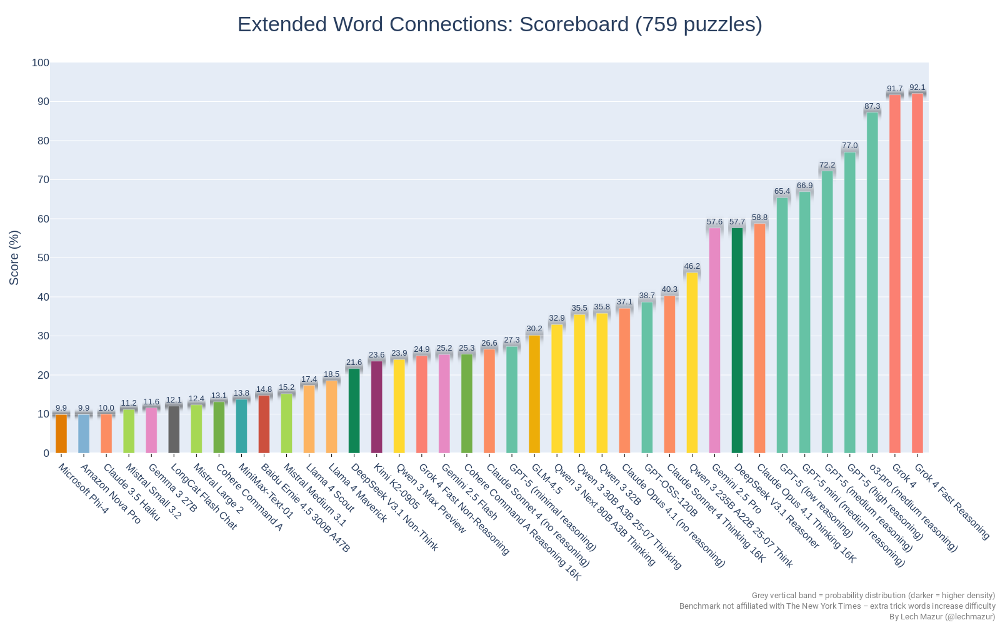
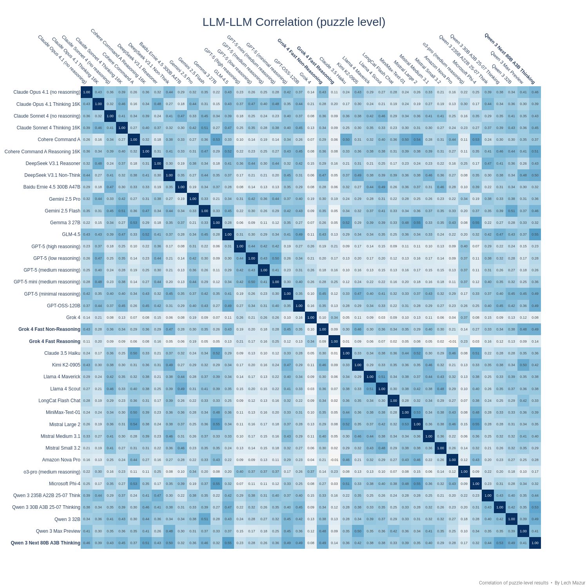
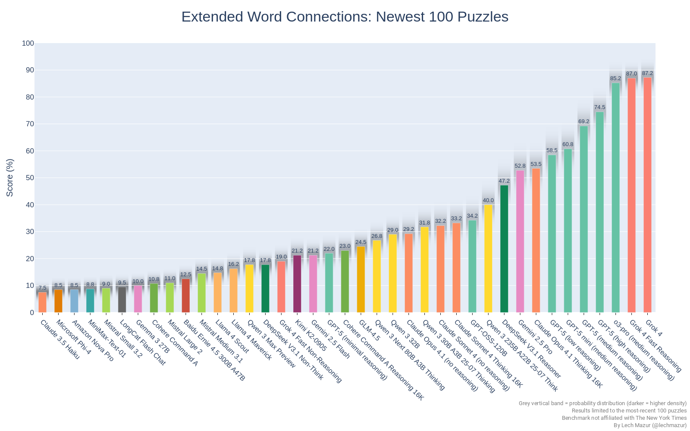

# Extended Version

This benchmark evaluates large language models (LLMs) using 651 NYT Connections puzzles, with additional words included to increase difficulty.

As of Feb 4, 2025, there is a new version of the benchmark. The standard NYT Connections benchmark is nearing saturation, with o1 scoring 90.7 and o3, along with other reasoning models, expected this year. The current rules require knowing only three categories, letting the fourth fall into place. To increase difficulty, Extended Connections adds up to four extra trick words to each puzzle. We double-check that none of the added words fit into any category used in the corresponding puzzle. New puzzles have expanded the total from 436 to 651. Rankings changed little, but the benchmark is now ready for o3. 

### Chart: Extended Version

### Leaderboard: Extended Version

|Rank|Model|Score %|#Puzzles|
|---:|-----|------:|-------:|
|1|Grok 4|91.7|759|
|2|o3-pro (medium reasoning)|87.3|759|
|3|o1-pro (medium reasoning)|82.5|651|
|4|o3 (high reasoning)|78.6|759|
|5|o4-mini (high reasoning)|73.6|759|
|6|o3 (medium reasoning)|73.0|759|
|7|GPT-5 (medium reasoning)|72.2|759|
|8|o1 (medium reasoning)|70.8|651|
|9|o4-mini (medium reasoning)|68.8|651|
|10|GPT-5 mini (medium reasoning)|66.9|759|
|11|o3-mini (high reasoning)|61.4|651|
|12|Claude Opus 4.1 Thinking 16K|58.8|759|
|13|Gemini 2.5 Pro|57.6|759|
|14|Qwen 3 235B A22B|54.3|759|
|15|Gemini 2.5 Pro Exp 03-25|54.1|651|
|16|o3-mini (medium reasoning)|53.6|651|
|17|Claude Opus 4 Thinking 16K|49.7|759|
|18|DeepSeek R1 05/28|48.6|759|
|19|Qwen 3 235B A22B 25-07 Think|46.2|759|
|20|Gemini 2.5 Pro Preview 05-06|42.5|651|
|21|Claude Sonnet 4 Thinking 16K|40.3|759|
|22|Claude Sonnet 4 Thinking 64K|39.6|651|
|23|GPT-OSS-120B|38.7|759|
|24|DeepSeek R1|38.6|651|
|25|Claude Opus 4.1 (no reasoning)|37.1|759|
|26|Qwen 3 30B A3B|36.6|759|
|27|Qwen 3 32B|35.8|759|
|28|Claude Opus 4 (no reasoning)|34.4|759|
|29|GPT-4.5 Preview|34.2|651|
|30|Claude 3.7 Sonnet Thinking 16K|33.6|651|
|31|Qwen QwQ-32B 16K|31.4|651|
|32|Grok 3 Mini Beta (high)|30.2|759|
|33|GLM-4.5|30.2|759|
|34|o1-mini|26.9|651|
|35|Claude Sonnet 4 (no reasoning)|26.6|759|
|36|Grok 3 Mini Beta (low)|26.0|651|
|37|Quasar Alpha|25.4|651|
|38|Gemini 2.5 Flash Preview (24k)|25.2|759|
|39|GPT-4o Mar 2025|24.5|759|
|40|Gemini 2.0 Flash Think Exp 01-21|23.1|649|
|41|GPT-4.1|22.8|759|
|42|GPT-4o Feb 2025|22.7|651|
|43|Gemini 2.0 Pro Exp 02-05|21.7|651|
|44|MiniMax-M1|21.3|688|
|45|Kimi K2|19.8|759|
|46|Grok 3 Beta (no reasoning)|19.7|759|
|47|Grok 2 12-12|19.2|651|
|48|Gemini 1.5 Pro (Sept)|19.2|601|
|49|Claude 3 Opus|19.2|650|
|50|Claude 3.7 Sonnet|19.2|651|
|51|Gemini 2.0 Flash|18.8|651|
|52|GPT-4o 2024-11-20|18.7|601|
|53|Llama 4 Maverick|18.5|759|
|54|Qwen 2.5 Max|18.0|651|
|55|GPT-4o 2024-08-06|17.8|601|
|56|Claude 3.5 Sonnet 2024-10-22|17.7|651|
|57|Llama 4 Scout|17.4|759|
|58|DeepSeek V3-0324|16.8|759|
|59|Llama 3.1 405B|16.2|651|
|60|DeepSeek V3|15.1|651|
|61|Llama 3.3 70B|15.1|651|
|62|Baidu Ernie 4.5 300B A47B|14.8|759|
|63|GPT-4.1 mini|14.4|759|
|64|MiniMax-Text-01|13.8|759|
|65|Cohere Command A|13.1|759|
|66|Mistral Large 2|12.4|759|
|67|Gemma 2 27B|12.2|651|
|68|Gemma 3 27B|11.6|759|
|69|Mistral Medium 3|11.5|759|
|70|Mistral Small 3.1|11.4|651|
|71|Mistral Small 3.2|11.2|759|
|72|Qwen 2.5 72B|10.5|759|
|73|Claude 3.5 Haiku|10.0|759|
|74|Amazon Nova Pro|9.9|759|
|75|Microsoft Phi-4|9.9|759|
|76|GPT-4o mini|9.7|759|
|77|Mistral Small 3|8.9|601|
|78|GPT-4.1 nano|8.1|759|
|79|GLM4-32B-0414|7.6|759|
|80|Claude 3 Haiku|2.2|601|

---
### Correlation of puzzle-level results: heatmap

---
## Newest 100 puzzles. 

To counteract the possibility of an LLM's training data including the solutions, we have also tested only the 100 latest puzzles. Note that lower scores do not necessarily indicate that NYT Connections solutions are in the training data, as the difficulty of the first puzzles was lower.

---
### Chart: Newest 100 puzzles, extended version

---
# Humans vs. LLMs

To explore how top language models (LLMs) compare to humans in the New York Times Connections puzzle, we used official NYT performance data from December 2024 to February 2025, as analyzed by u/Bryschien1996, alongside a simulated gameplay setup that mirrors the human experience. This setup involves a multi-step process where solvers iteratively propose groups, receive feedback ("correct," "one away," "incorrect"), and are allowed up to four mistakes before failing. According to NYT data, the average human player solved approximately 71% of puzzles over the three-month period from December 2024 to February 2025, with solve rates ranging from 39% on the toughest days (e.g., February 2, 2025) to 98% on the easiest (e.g., February 26, 2025). It's worth noting that NYT Connections players are self-selected and likely perform better than the general population. We collected data from nine LLMs spanning a range of scores in the Extended Connections benchmark.

The results reveal that top reasoning LLMs from OpenAI consistently outperform the average human player. DeepSeek R1 performs closest to the level of an average NYT Connections player.

Elite human players, however, set a higher standard, achieving a 100% win rate during the same period:

o1, with a 98.9% win rate, comes close to this elite level. o1-pro, which has not yet been tested in this gameplay simulation setup, might be able to match these top humans. Thus, directly determining whether AI achieves superhuman performance on NYT Connections could hinge on comparing the number of mistakes made before fully solving each puzzle.

---

# Original NYT Connections LLM Benchmark

This benchmark evaluates large language models (LLMs) using 436 NYT Connections puzzles. Three different prompts, not optimized for LLMs through prompt engineering, are used. Both uppercase and lowercase puzzles are assessed.

### Chart: Original Version

### Leaderboard: Original Version

| Model | Score |
| --- | --- |
| o1 | 90.7
| o1-preview | 87.1
| o3-mini | 72.4
| DeepSeek R1 | 54.4
| o1-mini | 42.2
| Multi-turn ensemble | 37.8
| Gemini 2.0 Flash Thinking Exp 01-21 | 37.0
| GPT-4 Turbo | 28.3
| GPT-4o 2024-11-20 | 27.9
| GPT-4o 2024-08-06 | 26.5
| Llama 3.1 405B | 26.3
| Claude 3.5 Sonnet (2024-10-22) | 25.9
| Claude 3 Opus | 24.8
| Grok Beta | 23.7
| Llama 3.3 70B | 23.7
| Gemini 1.5 Pro (Sept) | 22.7
| Deepseek-V3 | 21.0
| Gemini 2.0 Flash Exp | 20.0
| Gemma 2 27B | 18.8
| Qwen 2.5 Max | 18.6
| Gemini 2.0 Flash Thinking Exp	| 18.6
| Mistral Large 2 | 17.4
| Qwen 2.5 72B | 14.8
| Claude 3.5 Haiku | 13.7
| MiniMax-Text-01 | 13.6
| Nova Pro | 12.5
| Phi-4 | 11.6
| Mistral Small 3 | 10.5
| DeepSeek-V2.5 | 9.9

---

## Notes
- A temperature setting of 0 was used
- Partial credit is awarded if the puzzle isn't completely solved. 
- Only one attempt is allowed per puzzle. Humans solving puzzles on the NYT website get four attempts and a notification when they're one step away from the solution.
- Multi-turn ensemble is my unpublished system. It utilizes multiple LLMs, multi-turn dialogues, and other proprietary techniques. It is slower and more costly to run but it does very well. It [outperforms](https://x.com/LechMazur/status/1828804485033992514/photo/1) non-o1 LLMs on MMLU-Pro and GPQA.
- This benchmark is not affiliated with the New York Times

---

## Other multi-agent benchmarks
- [BAZAAR - Evaluating LLMs in Economic Decision-Making within a Competitive Simulated Market](https://github.com/lechmazur/bazaar)
- [Public Goods Game (PGG) Benchmark: Contribute & Punish](https://github.com/lechmazur/pgg_bench/)
- [Elimination Game: Social Reasoning and Deception in Multi-Agent LLMs](https://github.com/lechmazur/elimination_game/)
- [Step Race: Collaboration vs. Misdirection Under Pressure](https://github.com/lechmazur/step_game/)

## Other benchmarks
- [LLM Thematic Generalization Benchmark](https://github.com/lechmazur/generalization/)
- [LLM Creative Story-Writing Benchmark](https://github.com/lechmazur/writing/)
- [LLM Confabulation/Hallucination Benchmark](https://github.com/lechmazur/confabulations/)
- [LLM Deceptiveness and Gullibility](https://github.com/lechmazur/deception/)
- [LLM Divergent Thinking Creativity Benchmark](https://github.com/lechmazur/divergent/)

---

## Updates
- Aug 7, 2025: GPT-5 added.
- Aug 5, 2025: Claude Opus 4.1, GPT-OSS-120B added.
- July 28, 2025: GLM-4.5, Qwen 3 235B A22B 25-07 Thinking added.
- July 14, 2025: 108 new puzzles added. Kimi K2 added.
- July 10, 2025: Grok 4 added.
- July 3, 2025: Qwen 3 32B, GLM4-32B-0414 added.
- July 2, 2025: Baidu Ernie 4.5 300B A47B, MiniMax-M1, Mistral Small 3.2 added.
- June 10, 2025: o3-pro added.
- June 5, 2025: Gemini 2.5 Pro Preview 06-05 added. 
- May 28, 2025: DeepSeek R1 05/28 added.
- May 22, 2025: Claude 4 models added.
- May 7, 2025: Gemini 2.5 Pro Preview 05-06 added. Mistral Medium 3 added.
- Apr 30, 2025: Qwen 3 added.
- Apr 18, 2025: o3, o4-mini, Gemini 2.5 Flash Preview added.
- Apr 15, 2025: GPT-4.1 added.
- Apr 10, 2025: Grok 3 added.
- Apr 5, 2025: Llama 4 Maverick, Llama 4 Scout added.
- Mar 28, 2025: GPT-4o March 2025 added.
- Mar 25, 2025: 50 new questions added. Gemini 2.5 Pro Exp 03-25 and DeepSeek V3-0324 added.
- Mar 23, 2025: Humans vs. LLMs section added.
- Mar 21, 2025: o1-pro added. o3-mini-high added.
- Mar 17, 2025: Cohere Command A and Mistral Small 3.1 added.
- Mar 12, 2025: Gemma 3 27B added.
- Mar 7, 2025: Qwen QwQ added.
- Feb 27, 2025: GPT-4.5 Preview added.
- Feb 24, 2025: Claude 3.7 Sonnet Thinking, Clade 3.7 Sonnet, GPT-4o Feb 2025, Qwen 2.5 Max, GPT-4o 2024-11-20 added.
- Feb 6, 2025: Gemini 2.0 Pro Exp 02-05 added.
- Feb 4, 2025: A new, more challenging version with extra words in each puzzle. Separate scoring for the 100 newest questions. Correlation heatmap.
- Jan 31, 2025: o3-mini (72.4) added.
- Jan 30, 2025: Mistral Small 3 (10.5) added.
- Jan 29, 2025: DeepSeek R1 (54.5) added.
- Jan 28, 2025: Qwen 2.5 Max (18.6) added.
- Jan 22, 2025: Phi-4 (11.6), Nova Pro (12.5), Gemini 2.0 Flash Thinking Exp 01-21 (37.0) added.
- Jan 16, 2025: Gemini 2.0 Flash Thinking Exp, o1, MiniMax-Tex-o1 added. Gemini 2.0 Flash Thinking Exp sometimes hits the output token limit.
- Dec 27, 2024: GPT-4o 2024-11-20, Llama 3.3 70B, Gemini 2.0 Flash Exp, Deepseek-V3 added. Gemini 2.0 Flash Thinking Exp could not be benchmarked because its output gets cut off for some puzzles.
- Claude 3.5 Haiku added. 13.7.
- Claude 3.5 Sonnet (2024-10-22) added. Improves from 25.9 from 24.4.
- Grok Beta added. Improves from 21.3 to 23.7. It's described as "experimental language model with state-of-the-art reasoning capabilities, best for complex and multi-step use cases. It is the successor of Grok 2 with enhanced context length."
- Follow [@lechmazur](https://x.com/LechMazur) on X (Twitter) for other upcoming benchmarks and more.

